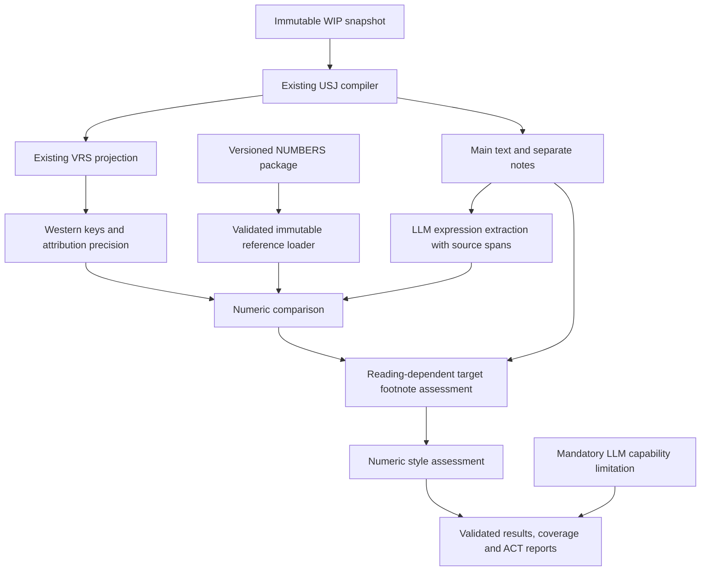

# Number Consistency & Accuracy — finalized functional design

Date: 2026-09-09. Repository inspected: `b4ec29d` (clean before this review).
Status: functional decisions finalized with the user, including current LLM capability disclosure and future SQS confidence checks. Implementation is planned; NCA product code is not yet implemented.
User-facing name: **Number Consistency & Accuracy (NCA)**, also **SAGE NUMBERS CHECK**.
Workflow identifier: `nca`; check identifier: `NUMBERS`.
Main Menu: **5. Number Consistency & Accuracy (NCA)**, immediately after **4. Source Text Correspondence (STC)**. Move SAGE Maintenance from 5 to 6.

## 1. Review scope and authority of the documents

The original request was to analyze the handover and plan implementation; the user has now finalized the workflow decisions below. The bootstrap's instructions to integrate, run acceptance tests, and eventually declare readiness describe the proposed implementation task; they do not expand this request into authorization to implement it. “Locked” and “certified” describe the handover author's intended contract and certification claim. This review evaluates those claims against the supplied files and current repository.

Reviewed: the external bootstrap and verification JSON; archive START_HERE, CURRENT_STATUS, LOCKED_DECISIONS, docs 01–08, older specification, style form and ACT template; all reference table schemas and integrity; workbook; source package correspondence; relevant SAGE implementation and tests. Research-source URLs were not consulted and scholarship conclusions were not independently reassessed.

Original archive:
`SAGE_NUMBERS_CODEX_HANDOVER_0.02a1_2026-09-09.zip`

SHA-256: `f4b826a167c6f26f05799f121d9f279cd89db3cd5d7d9bca916fc3a9baf775b1`

The initial local readback is recorded in [NCA-HANDOVER-AUDIT.json](2026-09-09-NCA-HANDOVER-AUDIT.json). The subsequent [final reference audit](2026-09-09-NCA-FINAL-REFERENCE-AUDIT.md) and its [machine receipt](2026-09-09-NCA-FINAL-REFERENCE-AUDIT.json) supersede the initial interpretation of the supplementary expression-audit discrepancy. The original archive and reference files were not modified or imported into runtime storage. Finalization rechecked all 37 archived checksums and all 6,244 authoritative value pairs. The unpacked style questionnaire differs from the archived form; this is a working-form difference, not a reference-table integrity failure, and is documented in the setup questionnaire.

The user has explicitly confirmed that these indexes are authoritative, with OL primary, NIV secondary, and the supplied notes/provenance governing doubtful or uncertain readings. NCA checks numeric accuracy against those indexes, consistency of presentation against the selected style guide, and target footnote adequacy where alternate/doubtful numbers warrant disclosure. It recommends adding or revising footnotes when needed and avoids duplicate recommendations when an adequate note already exists.

## 2. Assessment

The handover provides a substantial reference baseline and a useful OL-first decision policy. Implementation can be planned now. It is not yet a fully executable numeric specification: some tables contain prose rather than typed rules, multilingual interpretation depends on the configured LLM, and the expression audit does not reconcile with runtime values.

| Check | Observed result | Meaning |
|---|---|---|
| Listed archive checksums | 37/37 match | Integrity of listed bytes, not certification of semantic correctness |
| Operator rows / duplicate Western keys | 6,244 / 0 | Matches handover |
| Variant / footnote / unit rows | 21 / 21 / 12 | Matches handover |
| Expression / override / token-audit rows | 6,749 / 450 / 341 | Matches file-count claims |
| Provenance records / unresolved source IDs | 38 / 0 | References resolve locally; source claims not independently verified |
| Token coverage classes | 165 NUMERIC, 171 EXCLUDED_LEXICAL_HOMOGRAPH, 3 COMPOUND_COMPONENT, 2 QERE_SUPERSEDED | All 341 rows classified |
| Workbook versus operator TSV | Exact normalized cell equality | Discrepancy is not an XLSX export error |
| Workbook formulas / error-typed cells | 0 / 0 | Matches verification claims |
| OL Scripture corpus | 39 HEB + 27 GRK SFM files byte-identical to bundled SAGE files | Current bundled text is compatible with the supplied corpus |
| Handed-over mapping versus bundled eng.vrs | Same forward projection at all 6,244 indexed keys | Reuse SAGE's mapper, retaining package provenance |
| USJ probe | Main text excludes the preserved footnote | Existing parser supplies the necessary separation |

### Supplementary audit detail — does not override index authority

The runtime operator table has **4,392 nonempty OL numeric rows and 6,800 numeric values**. The expression audit has **4,376 distinct OL_REF values and 6,749 expressions**. Aggregating expression-audit values in EXPR_NO order disagrees with the runtime table at **47 rows**. None of those 47 OL coordinates has a matching row in `normalization_overrides.tsv`.

Examples:

| OL reference | Runtime OL_VALUES | Expression audit aggregate |
|---|---|---|
| EXO 12:18 | `1;14;21` | `14;21` |
| EXO 16:30 | `7` | empty |
| EXO 20:5 | `3;4` | `3` |
| 2CH 10:12 | `3;3` | empty |

The final audit establishes that both authoritative indexes agree on all OL/NIV values. All 47 differences are additional index values relative to the supplementary expression audit: 51 additional values across 47 rows, including 16 newly numeric rows; none of the audit's values is removed. Use the authoritative operator TSV unchanged. Preserve the discrepancy as `REFERENCE_LINEAGE_INCOMPLETE`, an audit warning, and do not claim complete expression-level provenance for these rows. This warning alone must neither block accuracy checking nor cause values to be replaced. Supplementary audit reconciliation can be done separately; it is not a precondition for using the user-confirmed authoritative indexes. The historical 6,749-expression count remains a count of the supplementary audit, not a runtime total.

The inherited `BASE_REGRESSION_GATE=PENDING_FINAL_RUN` remains unchanged. A future SAGE qualification receipt belongs outside the immutable workbook.

## 3. Existing owners and concrete integration points

Paths below are relative to `app/`.

| Concern | Existing owner | Proposed integration |
|---|---|---|
| Workflow identity / registration | `system/src/sage/workflow_identity.py`, `jobs.py`, `cli.py`; workflow profiles and schemas | Add explicit `nca` identity, bindings, validation and dispatch. There is no general NUMBERS plugin registry to populate. |
| Task orchestration | `act_tasks.py`: ACT_OPERATIONS, create_act_task, submit_act_task, aggregate_act_plan | A small NCA dispatch to focused modules; do not expand the large RTC implementation with numeric logic. |
| Job / Run / snapshot lifecycle | `jobs.py`: JobStore; `job_snapshots.py`, `job_layout.py`, `storage.py` | Reuse owned WIP snapshots, run directories, fingerprints, locks, events and report locations. |
| Scripture loading | `scripture.py`: compile_project; `usj.py`: compile_usfm_text, parse_usj_units | Use `body_text_exact`, nested `content`, raw USFM and source locators. No new USFM parser. |
| Target footnotes | `usj.py`: NOTE_CONTAINERS, _parse_note_content, verse content nodes | Add an NCA tree visitor for f/fe/ef/efe. Exclude x/ex and fr/fv locator digits from numeric footnote evidence. |
| Versification | `versification_service.py`: project_schema, to_canonical, from_canonical; `vrs.py`: parse_vrs_file and VerseRef; `verse_alignment.py`: ProjectVerseIndex | Project local WIP references through org identity into the package's Western keys; preserve mapping precision and all three identities. |
| ACT findings and coverage | `act_outputs.py`, `findings.py`, `coverage.py`, `work_units.py`; RTC/STC-specific validators | Add a NUMBERS result schema/validator. Reuse global IDs and exact coverage concepts without presenting NUMBERS as RTC findings. |
| Operator reporting | `act_outputs.py`, `stc_reporting.py`, `human_output.py`, `report_authority.py` | Add NCA-specific report projection using shared rendering/language conventions. Machine evidence remains canonical. |
| Profiles and local resources | `profiles.py`, `language_profiles.py`, `linguistic_profiles.py`, `resource_rights.py`, `resource_registration.py`, `storage.py` | Number-language and style profiles are separate contracts; reuse storage/provenance patterns. Bind package ID/hash, not an invented Scripture project. |
| Validation / distribution | `schema_validation.py`, `system/tools/validate_schemas.py`, `validate_package.py`, `deep_audit.py`, `build_release.py` | Register new schema owners; keep operator data outside Core releases. |
| Tests | `system/tests/`, pytest; `.github/workflows/ci.yml` at repository root | Add numeric unit/contract/integration tests and retain CI on Python 3.10/3.12 across Linux/macOS/Windows. |

### Repository conflicts that need explicit handling

1. **Coordinate identity:** `ecosystem.yml` uses `canonical_file: org.vrs`, `default_file: eng.vrs`. “Canonical” in the handover means Western. Do not change SAGE's global canonical file. Name fields `western_reference`, `target_reference`, `ol_reference`, and `canonical_references` distinctly.
2. **Authority:** RTC compares WIP to a Reference Project; ordinary RTC disallows OL drift adjudication. STC explicitly excludes a Reference Project and reference-derived evidence. Neither is a suitable unchanged host for OL-primary/NIV-secondary NCA.
3. **Legacy focused checks:** `focused` belongs to compatibility SAW operations, not a new canonical workflow. Do not resurrect SAW to obtain a check menu.
4. **Footnotes:** RTC's default `f: STRUCTURE_ONLY` cannot govern NCA's required material disclosure check. NCA needs its own footnote policy.
5. **Findings:** existing category/outcome enumerations do not include the handover's NUMBERS results. Use a typed NCA payload, retaining SAGE action levels INFORMATION/REVIEW/CHANGE/BLOCK and confidence HIGH/MEDIUM/LOW/UNKNOWN.
6. **Authority source selection:** the index is the authority for NCA, with its supplied OL corpus identity retained as provenance. Current bundled OL files match. A different Project-bound OL resource must not replace the index or silently change NCA authority; supplementary source evidence must be explicitly compatible with the bound package.
7. **Release naming:** The handover archive retains its original development identity. The user subsequently authorized consolidating `0.02a1` into `main` as `0.02b1` before NCA/SQS implementation; runtime NCA remains planned.

## 4. Approaches considered

| Approach | Benefit | Cost / limitation |
|---|---|---|
| **Independent NCA workflow using shared SAGE infrastructure — selected by user** | Clear authority, standalone operator check, LLM interpretation with deterministic authority rules, correct lifecycle | Explicit integration across workflow allowlists, bindings, schemas and UI |
| NCA option inside STC | Fewer initial operator surfaces; OL-first starting point | Requires altering STC's no-reference-evidence contract; narrower-looking patch hides authority changes |
| Standalone script or legacy focused prompt | Fast demonstrator | Misses canonical Jobs, replay, coverage and reporting; unsuitable as final architecture |

Build the numeric library first, then integrate it as `nca` with operation `numbers`. This is a new domain implementation and workflow adapter within SAGE, not a second job/check framework. Do not merely add `nca` to generic analysis sets: several branches assume that any analysis workflow other than STC is RTC. Audit each branch before adding membership.

## 5. Proposed runtime design

### Reference and persistence

Store an explicitly imported unchanged package under `localdata/inputs/resources/numbers/<package-id>/`. Use `storage_layout`, not a hardcoded localdata location. Pin a package checksum and the checksums of the runtime index, variant registry, footnote guidance, units, mapping and provenance. Source zips and XLSX remain audit inputs; runtime does not open Excel or regenerate OL data. Historical diagnostics are never runtime inputs.

Maintain an external qualification receipt recording package hashes, validation method/version, discrepancies, and status. Store derived caches under the resolved `.system/indexes/numbers/` area. Every cache key includes package, parser, profile and mapping versions. Runs snapshot exact resource/profile identities; a different import never changes an existing Run. Reference failure blocks dependent accuracy checks. A validated number-style profile is a required Job binding, independently of Run toggles. Disabling presentation assessment does not bypass profile selection or validation.

Support literal table policy values `NONE_TEXT_CRITICAL` and `N/A` through an explicit normalizer, retaining raw values. Also preserve `CAUTION_ACCEPTABLE_ATTESTED_MINOR_READING_WITH_FOOTNOTE` at 1SA 6:19 and `NO_CONFIGURED_OL_READING` at NEH 7:68. The former is a registered acceptable minority reading with a required note and retained caution; the latter is a registered absence, not an OL numeric pass or zero. Generic summary outcomes must not erase these distinctions.

The operator index adds all 12 unit explanations to TEXTUAL_CRITICAL_NOTE, whereas the older canonical index leaves those cells empty. Prefer the operator index's explanation. Three unit-registry NIV_TEXT copies have missing spaces (LUK 13:21; 16:6–7); use operator-index NIV_TEXT for display and preserve the original unit-registry bytes for provenance.

### Coordinates and coverage

Use the effective WIP VRS to obtain SAGE canonical equivalence groups, then the immutable package ENG→ORG mapping to obtain Western index keys. Compare that mapping with the configured baseline; record disagreement instead of inferring shifts. Current forward mapping agreement does not certify all reverse projections or arbitrary custom VRS.

Preserve WIP-local coordinates for operator navigation and Western coordinates for lookup. Keep `OL_REF` nullable: NEH 7:68 has no source coordinate. Handle that registered omission/addition before ordinary missing-coordinate logic. Never fabricate OL text, or attach NEH 7:69's source value to NEH 7:68 through an identity fallback. Repeated mappings such as PSA 51:0 require sets, not a last-write-wins dictionary.

At Western 1SA 20:42 and 1CH 12:4, the index's OL_REF identifies the source portion containing the numeric evidence, while the supplied shift rule projects to the following source portion (1SA 21:1 / 1CH 12:5). The index OL_TEXT matches the source at its stored OL_REF. Do not rewrite OL_REF from the mapping or require it to equal the mapping's sole projected coordinate. Direct Western targets use the Western row as supplied; non-Western target attribution must preserve the combined verse-boundary group and avoid comparing the row's numbers only against the continuation portion.

Distinguish canonical Psalm superscriptions from editorial headings. The indexed PSA 60:0 contains 12000 and has OL_REF=PSA 60:2; its target superscription is accuracy-bearing content even if represented by a USFM `\\d` node rather than `\\v 0`. Collect that structural content explicitly. Do not let ordinary heading exclusion silently skip this authoritative row.

Build scope coverage from the selected WIP scope plus expected reference/registry coordinates, not only rows containing target text. An absent or note-only verse can still require a footnote decision. Verse bridges are compared once as a group; do not duplicate target expressions for each verse. Where a critical reading or note cannot be attributed inside a bridge, report insufficient attribution.

The 6,244-row table is a numeric OL/NIV union, not full Bible coverage. A missing row is `REFERENCE_NOT_INDEXED`, not evidence of zero numbers. Scan target numeric candidates across the entire requested scope, and report unindexed candidates as insufficient reference evidence. In particular, DAN 1:10 is absent from the runtime table: test its excluded homograph through the audit, not by inventing a zero-valued reference row. A future complete absence-of-number manifest is separate reference maintenance.

### Expressions and language support

Use exact `fractions.Fraction` arithmetic. A normalized expression contains value(s), kind (cardinal/ordinal/fraction/range/ratio), surface span, source locator, unit, approximation/comparison qualifier, grouping/role evidence, language and parser version. Keep multiplicity and order. Preserve original text; normalization must map back to original spans.

LLM language capability is distinct from formatting preference. Handle configured Unicode decimal digits and separators; do not guess whether `1,234` is a decimal or thousands grouping. The extraction task must recognize composition and scale words, ordinals versus partitives, ranges and qualifiers. Ordinal 3 and cardinal 3 carry different kinds even where the reference encoding stores both as `3`.

Use the configured LLM for target-language numeric interpretation, including words, composition, morphology, ordinals, partitives, referents and context. No fixed launch-language list or hand-written parser is required as the product gate. Validate exact source spans and normalized quantities independently; preserve reported ambiguity as `INSUFFICIENT_EVIDENCE`. Finding no digits does not establish that the text contains no numbers. The user deferred shared SQS confidence checks to future functionality. Current reports must state that findings are limited by the selected LLM's language and numeric-interpretation capabilities; do not claim measured confidence or SQS qualification.

Use the runtime table for OL values. Join expression-audit spans only when reconciled and complete; do not let the stale audit replace values or invent source roles. A row can have value agreement but insufficient semantic evidence to rule out changed units or reassigned quantities. Report the limitation instead of promoting flat equality to a fully supported pass.

### Comparison and equivalence

Process exact supported semantic correspondence, approved composition/order equivalence, registered unit equivalence, registered alternate, then omissions/additions/value differences. Style runs afterward.

Never sort all values or compare sets globally: `3 sheep, 7 goats` and `7 sheep, 3 goats` are not equivalent. Approved reordering must preserve quantity-to-referent relationships, numeric kind, units, ratios and multiplicity. Preserve JDG 20:10 ratios and REV 5:11 independent myriads/thousands. The 62 rows labeled `PASS_EQUIVALENT_REORDERED` are OL/NIV precedents, not blanket permission for target permutations.

The 21-row variant registry and footnote guidance jointly authorize alternates; NIV equality outside that registry does not. Match the whole supported expression sequence, including unchanged values: e.g. 2CH 22:2 has OL `42;1` and alternate `22;1`, not just a substitution of 42 with 22 regardless of other changes. A registered omission uses a reading-state enum, not a numeric zero.

The 12 unit rows are prose examples, not a universal conversion database. Build a typed adapter for their supplied quantities, units, ranges, qualifiers and scope. It must retain unrelated quantities in the verse (JHN 2:6 includes the jar count outside its `2–3 metretes` conversion). Sata→pounds is a registered context-specific example, not a universal volume-to-mass equation. Accept only the supported example/context; unprovided conversion factors or tolerances require a separate governed rule. No binary floating point or invented ±percentage tolerance.

### Footnotes

Select the reading first, then apply its footnote action even when the main text matches OL. DIVIDED rows require disclosure for either supported choice. RECOMMEND produces an advisory without reversing OL numeric accuracy. REQUIRE with missing or materially inadequate disclosure produces `REVIEW_MISSING_FOOTNOTE`.

Assess only WIP footnote content associated with the selected coordinate/group. An unrelated note with a matching numeral is not adequate. Recognized evidence must tie an alternate quantity, witness/tradition difference, or reconstruction disclosure to the relevant numeric issue. Exact suggested wording is unnecessary. Exclude chapter/verse locator numbers, cross-references and NIV notes from this check.

Preserve separate fields for semantic outcome, selected reading, action, assessment, and final outcome. Unsupported note language/ambiguous disclosure is `NOT_ASSESSED` plus insufficient evidence, not “missing” and not a pass. Use the configured LLM to assess material disclosure with exact target-note evidence and the selected reading's registered guidance. Validate that cited evidence belongs to the note and coordinate. A matching numeral alone cannot establish adequacy. SQS confidence checks are future functionality; the current report limitation applies to this judgment as well. The model cannot create variants or overrule deterministic policy.

### Style

Provide a standard **NCA Number Style Profile template**, following RTC's language-profile selection/validation pattern. Each Job must bind exactly one compatible, configured number-style profile during setup, even if presentation consistency is later switched OFF. Reuse an existing compatible profile or create one from the template; the operator need not start a new guide for each Job. This user clarification supersedes the earlier optional-guide design.

Convert the supplied paper form into a versioned native template with profile ID/version, Project/language/script applicability, style-guide source, status, stable rule IDs, number-size bands, grouping and decimal conventions, ordinal/fraction/range display, qualifiers, context exceptions, abbreviation rules and scope (body/headings/footnotes). A blank draft template is not a selectable active profile. Each rule area must contain a configured rule or an explicit NOT_SPECIFIED/NOT_APPLICABLE decision; these decisions remain visible as unassessed/not-applicable areas. Preserve meaning first; no style rule can rewrite a normalized quantity or remove a meaningful “about”/“less than”.

Follow the existing Job profile resolver: one compatible profile can be selected automatically and displayed; multiple candidates require selection; none gives an actionable configure/import-profile message. Record the selected profile ID/version in the Job and its exact bytes/hash in each Run snapshot. Updates affect new Runs; existing Runs retain their original rules. The style profile remains distinct from the configured LLM route and its language capability. The concrete setup questions are in [NCA-STYLE-QUESTIONNAIRE.md](2026-09-09-NCA-STYLE-QUESTIONNAIRE.md).

For contexts that cannot be determined confidently, skip the context-specific rule with a visible assessment limit. Headings/footnotes can receive numeric style checks without contributing numbers to the main-text accuracy stream. Tables/maps/cross-reference styles require supplied parsed content; do not claim to assess unavailable assets.

Assess consistency across the selected scope by grouping comparable expressions under the same applicable guide rule, location and context. Report mixed presentations that violate that rule, while honoring approved exceptions. A majority format is not authority when the guide specifies another format. With no applicable guide rule, present an unassessed consistency area rather than inventing one. Canonical Psalm superscriptions retain their separate accuracy-bearing treatment described above.

### Checks before each Run — RTC-style toggles

The user selected pre-Run toggles following RTC's existing check-selection interaction. The required number-style profile is already bound during Job setup. Present these checks before starting each Run, initially ON, with saved Job defaults available for reuse:

| Check | Toggle | Prerequisite when ON |
|---|---|---|
| Number accuracy | ON / OFF | Authoritative number index and supported target extraction |
| Presentation consistency | ON / OFF | Selected number style guide and supported target extraction |
| Footnote review and recommendations | ON / OFF | Authoritative reading/footnote guidance and supported target-note assessment |

Show the bound style profile beside the presentation toggle, with an action to revise the Job's profile selection for a new Run. Require at least one enabled check. A missing/invalid bound profile requires configuration repair; turning presentation OFF does not waive this Job requirement. OFF checks are reported as `NOT ASSESSED — disabled for this Run`; they produce no findings and cannot be counted as passes. Explicitly unspecified individual rules remain unassessed rather than becoming invented defaults.

Toggles select assessments, not authority. Footnote review may determine the selected reading internally even when accuracy reporting is OFF; it must not emit an accuracy assessment in that mode. When footnote review is OFF, accuracy can identify a registered alternate, but cannot report `ACCEPTABLE_VARIANT_WITH_FOOTNOTE` or claim a required note was satisfied. Record the numeric correspondence with footnote compliance NOT ASSESSED. A presentation-only Run uses extraction for formatting and does not claim OL accuracy.

Reuse RTC's before-Run selection and immutable `check-policy.json` snapshot pattern, with an NCA-owned policy. Snapshot all three toggles, resource/profile hashes and the bound style-profile version at Run creation, including when presentation is OFF; resumed Runs retain that snapshot. Changes apply to a new Run. Keep default check selection and the mandatory style-profile binding at Job level.

### Results and operator experience

Keep per-unit results (including passes and unassessed states) separate from actionable findings. A single verse can have an OL accuracy pass, a recommended-note advisory and a numeric style finding. Preserve all three without duplicate coverage.

NCA result payloads carry Western/WIP/OL references, raw and normalized expressions, semantic and final outcomes, selected reading, variant/scholarship fields, footnote action/status/evidence, source IDs, profile/rule IDs and immutable evidence hashes. Reuse SAGE's global ID mechanism with a NUM prefix; the illustrative NUM-0001 in the template is not the globally unique identity.

Map recommendations/style to INFORMATION or REVIEW, unsupported numeric changes and missing required notes to REVIEW, and unusable inputs/reference validation failures to run-level BLOCK. Never automatically edit Scripture or Paratext Notes XML. Generate suggested notes as operator text.

Summary includes every handover counter plus indexed/unindexed coordinates and parser coverage. Count OL expressions actually assessed from the bound runtime rows, not the unreconciled static audit total. Each target span is counted once; group overlap cannot inflate results. A completed execution with insufficient evidence must not present an all-clear accuracy result.

Expose NCA as Main Menu **5. Number Consistency & Accuracy (NCA)** directly after STC; move SAGE Maintenance to **6** and update dispatch, help, localization, spacing and menu tests together. Bind one WIP, one immutable numbers package, the Project language identity, the configured LLM route and exactly one required number-style profile. No required RTC job, Reference Project or BIC generation. Preserve the existing provider-readiness requirements for model-dependent execution. Local profile/reference inspection need not run the model. Preserve the current read-only TUI limitations unless separately requested.

## 6. Delivery sequence and readiness

1. Implement reference validation and explicit unreconciled-reference reporting.
2. Implement USJ/VRS projection and exact scope coverage with synthetic reference fixtures.
3. Implement qualified language extraction and conservative semantic comparison.
4. Add registered variants, unit examples, reading-dependent footnote checks and numeric style.
5. Integrate NCA identity, Jobs/Runs, LLM task routing, deterministic result validation and operator surfaces.
6. Qualify the full real-data acceptance matrix and existing SAGE regressions before release.

Supplementary audit reconciliation is independent maintenance. The authoritative package can be used with the documented lineage warning. Software production qualification still requires the complete implementation/acceptance suite, correct treatment of documented boundary and policy cases, and immutable resource validation. Shared SQS confidence checking is recorded as future functionality and is not a first-release blocker.

At the initial planning review, the managed runtime lacked pytest. Subsequent filename-template repair work created an isolated test environment and passed 80 targeted tests; broader source/release checks exposed existing workspace artifacts and documentation issues. That separate repair is not NCA acceptance evidence. NCA still requires its own implementation and complete acceptance run.

## 7. Final decisions and report limitation

- Independent `nca` workflow and `NUMBERS` check; Main Menu #5 after STC, Maintenance #6.
- Authoritative OL-primary/NIV-secondary indexes, with registered notes/provenance governing alternate readings.
- Required reusable Number Style Profile at Job setup, plus the three independent pre-Run toggles.
- Configured LLM for multilingual extraction, context and numeric-footnote interpretation; deterministic checks preserve reference authority and validate evidence.
- Shared SQS confidence checks are future functionality. They do not block the current implementation and no provisional SQS thresholds or interfaces are invented.
- Retain the 47 supplementary-audit differences as documented lineage warnings, preserving all authoritative values.

Every report, including one with no findings, must display:

> Findings are limited by the selected LLM's language understanding and numeric-interpretation capabilities. SQS confidence checks have not been applied.

Carry the same limitation in machine-readable results and all report/export formats, localized consistently into the Job's reporting language. Record the actual provider/model identity. Numerical rule validation and reference integrity must not be presented as certification of the model's interpretation or of complete error detection.

Current and future behavior is specified in [NCA-SQS-INTEGRATION.md](2026-09-09-NCA-SQS-INTEGRATION.md). The setup form is [NCA-STYLE-QUESTIONNAIRE.md](2026-09-09-NCA-STYLE-QUESTIONNAIRE.md).

Implementation plan: [2026-09-09-NCA-IMPLEMENTATION.md](../plans/2026-09-09-NCA-IMPLEMENTATION.md). These documents finalize the functional design; they do not claim that the runtime feature is implemented or qualified.
