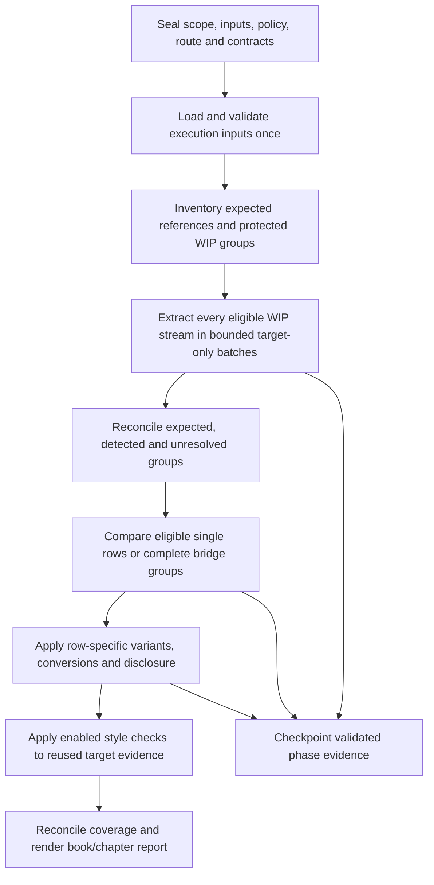

# NCA efficiency and accuracy optimization

**Status:** Proposed design for the requested optimization plan; runtime behavior is unchanged.

**Baseline:** `d957610` on `0.02a2`. The [existing qualification record](../../advanced/release/NCA-QUALIFICATION.md) records 1,530 passing clean-source tests, including 427 NCA tests. These establish software/reference acceptance, not measured live-model accuracy or optimized throughput.

**Companion:** [Implementation plan](../plans/2026-09-10-NCA-OPTIMIZATION.md).

## 1. Objective and decision

Reduce repeated model and local processing while improving numeric coverage and resolving supported WIP bridges. Use the reference index to establish expectations, independently extract numeric content from the entire selected WIP scope, then evaluate the union. Index-only selection misses unexpected numeric content outside indexed references; selection based only on detected WIP numbers misses complete omissions at expected references.

The principal optimization is bounded target-extraction batches plus reuse of validated execution inputs and completed phase results. Reordering dictionary lookups alone is not the performance objective. No language is assumed safe for digit-only or dictionary-only exclusion.

| Alternative | Decision |
|---|---|
| Only inspect indexed coordinates | Reject as the full-NCA default: loses unexpected/unindexed numeric content. |
| Per-unit WIP extraction followed by index lookup | Retain as the measured baseline and bounded fallback. |
| Expected-reference inventory plus full-scope batched extraction | Recommended: preserves both directions of coverage and reduces repeated request overhead. |

## 2. Observed implementation and optimization targets

| Current implementation | Consequence | Proposed change |
|---|---|---|
| `scope.project_scope` derives expected Western coordinates independently of observed WIP | Missing and unindexed coordinates remain visible | Preserve this behavior; add explicit inventory/candidate reasons. |
| `NcaModelTasks.extract` and `validate_extraction_response` accept exactly one work unit | Repeated prompts, schemas, and provider calls | Versioned batch extraction with per-unit evidence validation. |
| `engine.evaluate_run` calls `evaluate_unit` sequentially | Each unit starts its own extraction | Prepare target extractions once, then reuse them for applicable checks. |
| `_validate_task`, `_sealed_units`, and execution call `_bundle`; `evaluate_unit` validates style each time | Repeated qualification/parsing and profile work | One validated, immutable execution context per execution attempt. Measure the actual call counts before changing them. |
| `_execute_nca_task_locked` reuses a complete task result, but does not persist completed individual phases | Interrupted work cannot reuse those phases | Task-local validated phase checkpoints, with strict identity and receipt checks. |
| `engine.evaluate_unit` returns `MERGED_ALIGNMENT_UNAVAILABLE` for multiple Western references | Most ordinary multi-verse bridges remain unresolved | One protected group comparison with separately attributed reference rows. |
| `render_nca_report` lists units and findings in one Run report | References are present, but chapter organization is limited | Book/chapter sections and bridge detail, with one canonical finding ledger. |

The baseline currently supports exact target/source spans, rational values, typed correspondence, registered readings and conversions, separate notes/style streams, strict result replay, immutable Runs, and source qualification. Those protections remain acceptance requirements.

## 3. Global constraints

- Preserve Python 3.10 compatibility and the existing Linux/macOS/Windows CI matrix.
- Add no runtime dependency and no new general Job, provider, or confidence framework.
- Keep workflow `nca`, operation `numbers`, check `NUMBERS`, Main Menu NCA=5 and Maintenance=6.
- OL HEB/GRK remains Authority 1; NIV remains secondary; only registered whole readings and coordinate-specific unit pairs may be accepted.
- Keep a configured Number Style Profile mandatory even when presentation is OFF; retain the three independent check toggles and all-OFF rejection.
- Never write Scripture, Paratext Notes XML, reference packages, or historical sealed Run evidence.
- Keep WIP-local, Western, canonical, and stored nullable OL references distinct.
- Extract target numbers without supplying expected OL/NIV values, variant values, or expected-number flags to the extraction model.
- Do not treat an absent reference row as an authoritative zero-number row.
- Do not turn PARTIAL, UNSUPPORTED, invalid, missing, or oversized evidence into a pass.
- Preserve exact surfaces, offsets, rational values, kinds, qualifiers, units, referents, multiplicity, and provenance at every input/replay boundary.
- Use the existing routed-SFM sizing authority; never run the Scripture token estimator on prompts, JSON, profiles, schemas, IDs, hashes, or USJ projections.
- Keep independent semantic adjudications and note assessments separate; only target inventory extraction may share one bounded multi-unit review item.
- Keep the existing capability limitation and `SQS: NOT_APPLIED` in every report/export. Do not add a confidence cutoff or imply SQS qualification.
- Keep ordinary CI synthetic and provider-free. An actual model benchmark is a separately initiated run using existing authorized provider routing.

## 4. Proposed flow

### 4.1 Inventory and candidate selection

Create a ledger before model execution containing every expected Western coordinate, observed WIP group, registered source absence, mapping limitation, and eligible style stream. A scope that touches a bridge or required numeric boundary retains the complete protected group; show any necessary scope expansion in preflight and the report.

After extraction, define accuracy candidates as `expected indexed/registered groups ∪ detected numeric BODY groups ∪ unresolved BODY groups`. Note and editorial-heading numbers cannot satisfy or create a body-number finding; their coverage belongs to the enabled disclosure/style checks. Maintain the complete scope ledger even for non-candidates. A complete number-free unindexed group is screened as non-applicable, not recorded as an OL accuracy pass. A number-bearing unindexed group remains `REFERENCE_NOT_INDEXED`. A missing WIP coordinate keeps its mapping/coverage limitation; an existing empty target at an indexed reference can be assessed for omission. Registered OL absence, such as NEH 7:68, remains its own policy case.

Accuracy and footnote switches determine whether correspondence/disclosure runs. Presentation uses all applicable extracted body, note, and heading streams, not just indexed candidates. Disabled headings and irrelevant note streams must not create calls. A note needed for disclosure and style may reuse its validated extraction, while disclosure retains a separate row-specific interpretation.

### 4.2 Batching and transport

Start with a proposed cap of eight protected target units per extraction batch. This is a conservative initial configuration to benchmark, not a measured optimal size. Honor existing routed-SFM hard limits independently; the eight-unit cap never authorizes an oversized bridge. Prefer chapter boundaries, but do not split a protected group merely to meet a chapter preference or soft target. Keep different language, stream purpose, and parsing-convention identities in different batches. Default request concurrency remains one.

Use `sfm_slicer.plan_sfm_work_units`, `SfmAnalysisRoute`, and `SfmStream` rather than a new token estimator. The transport adapter must carry the exact bounded target SFM actually used for sizing and retain deterministic body/note/heading projections for offset validation. The current plain-text extraction payload cannot simply be counted as routed SFM. Link every projection to its source slice/hash; never reconstruct Scripture from model output or summarize it. Original marker/locator digits do not become body expressions. Note and heading content cannot be returned as body evidence. Projection/profile/schema overhead is transport telemetry, not Scripture sizing input. Provider transport rejection yields explicit failure or whole-unit batch splitting; it must not redefine the shared Scripture sizing policy.

Extraction receives only target evidence, language information, approved parsing conventions, and a bounded extraction process brief. It must not receive the full reference-bearing NCA instructions or expected-number inventory. The full registered Skill and its hash remain controller governance inputs; document the NCA extraction capsule in the existing model-handoff contract. Source comparison still receives the exact authorized reference rows and their policies. There is no shared conversation state between requests.

### 4.3 Batch response validation and failure recovery

The new response contract identifies the batch and returns an item for each admitted unit/stream. Each item uses the current exact expression validator: values, arity, span/surface equality, representations, roles, and limitations retain their constraints. Unit and expression IDs are scoped explicitly; order of returned items has no authority.

Unknown or duplicate unit IDs and malformed top-level envelopes invalidate the envelope. Within a valid envelope, independently valid items can be committed; omitted or invalid known items remain pending and cannot be silently completed. A declared PARTIAL/UNSUPPORTED result is preserved rather than retried until the model supplies a preferred answer.

For transport errors or malformed/truncated results, allow at most one transient retry for a request. Remaining failed multi-unit requests split deterministically at whole-unit boundaries until singleton requests. An unsplittable oversized unit remains unresolved. For `n` units, at most `2 × (2n − 1)` request attempts are possible in the complete failure tree; successful retained items are removed from further requests. Record all attempts and reasons. Do not change provider/model/reasoning automatically during fallback.

Each provider request has one receipt and one usage record. Every accepted item refers to that receipt and its own validated item hash. A batch of eight units is not eight provider calls. Do not multiply token/cost totals by member count or equate a structurally complete response with proven language capability.

### 4.4 Validated input reuse and checkpointing

Build one immutable execution context under the existing task execution lock after verifying the task, snapshot, route, package, mapping, style, and input hashes. Reuse its qualified bundle and validated profile throughout that attempt. Do not add a public `skip_validation` flag or retain a mutable package/path as authority. A fresh execution/resume revalidates the sealed inputs; the optimization does not bypass package integrity checks between attempts.

Checkpoint only within the existing governed task directory. The phase identity binds task fingerprint, ordered unit/stream identities, exact input bytes, mapping/package/profile hashes where applicable, route/capability/reasoning identity, phase version, response schema and validator version, and the extraction capsule/Skill hash. Start with same-task reuse only; cross-Run and global persistent caches are excluded.

Write an immutable attempt artifact, validate it, then atomically commit its ledger entry under the existing single-writer lock. Revalidate hashes, identities, and the current version-specific evidence contract before reuse. Preserve failed attempts for audit, but never treat them as accepted evidence. Ignore or diagnose uncommitted orphan attempts. Completed unsupported evidence remains unsupported. Distinguish a reused earlier provider receipt from a new provider call.

On finalization, rebuild the canonical result from accepted checkpoints and publish a manifest binding the final result and execution receipt. Recover an interrupted final publication only from verified checkpoints; preserve legacy handling for old tasks. A crash after a provider response but before its durable checkpoint may require another call: do not promise exactly-once external execution.

### 4.5 Bridge accuracy

A bridge remains one WIP text/extraction unit. Its covered Western rows remain separate immutable sources, each retaining exact OL text/values, nullable OL_REF, variant class, scholarship status, and permitted policies. No pooled flat-value comparison can establish a pass.

Add one correspondence request for a complete protected bridge group. The model returns exact source expressions separately for each row, target referent evidence, and explicit assignment of target expression IDs to rows. Controller validation must account for every source expression and every extracted target expression exactly once, or identify it as unmatched/unresolved. A ratio/range and a word-plus-digit representation remain one semantic expression; no arbitrary splitting is allowed. Ambiguous assignments are unresolved, not guessed.

Apply the existing typed comparator to each row's assigned target evidence, preserving repeated values and roles. Apply a textual alternate as one whole registered reading for that row; apply a conversion only at its registered row and verify unrelated residual quantities. A number moved or missing in one row cannot be concealed by an unrelated matching number in another row. Where the bridge provides no defensible row attribution, report group-level uncertainty instead of inventing verse precision.

Examples required by acceptance:

- Two rows with different quantities and clear target referents can both pass within one bridge.
- Two identical source quantities cannot both consume one target expression.
- Swapped referents do not pass merely because pooled values agree.
- Missing/added quantities remain findings; unresolved attribution points to the WIP bridge range.
- A registered reading, conversion, or disclosure for one row does not apply to its neighbor.
- A missing source row is unknown coverage; a registered OL absence remains explicitly nullable.
- PSA 60:0 and the existing 1SA 20:42 / 1CH 12:4 boundary cases retain their stored attribution.

Retain per-row assessment results within the parent group. An unresolved row prevents an overall all-clear when that assessment is required by an enabled check, while resolved row evidence remains visible. Presentation-only Runs leave numeric alignment NOT_ASSESSED rather than requiring an unnecessary correspondence call. Bridge footnotes require unambiguous linkage to the particular reading they disclose. A note may support multiple rows only when the separate assessments establish that support; equal character offsets in different notes are not duplicates.

### 4.6 Result contracts, reports, and compatibility

Introduce extraction/result contract version 2.0 and a versioned optimization policy for new Runs. Keep existing version-1.0 validators available for stored results. Completed old results remain readable and reproducible through their original contract; never synthesize group evidence or new receipts for them. In-flight old Runs whose sealed contracts no longer match the installed execution code require a new Run, preserving existing stale-contract safeguards.

Version 2.0 records parent WIP groups, separate reference rows and decisions, alignment status, per-expression ownership, phase receipt references, reused-checkpoint provenance, scope expansion, and derived metrics. Validate the same constraints for direct typed objects and serialized/replayed documents. Validate externally supplied expected-unit/evidence bounds; never let a new ledger declare its own completeness.

Continue producing one report per Run, organized by WIP book and chapter. Put bridge findings at their exact range; show per-reference detail only where alignment supports it. A group crossing chapter boundaries has one primary entry and cross-references, not duplicated findings or counters. Preserve existing global finding IDs, raw machine codes, primary/secondary report-language behavior, and all existing handover counters. Add model-call/reuse and coverage metrics through the current localization catalog.

## 5. Measurement and release gates

Capture phase/provider call counts, failures/retries, request/response transport bytes, routed-SFM estimates, provider-reported usage when available, elapsed times, reference load count/time, profile-validation count, checkpoint reuse, unresolved units, and exact expected/observed/assessed coverage. Unknown usage/cost remains null; do not invent token prices or count local work as provider calls.

Benchmark baseline and optimized behavior on identical scope, input bytes, style/check settings and fixtures, holding provider/model/reasoning selection fixed. Optimization contracts and Skill/schema versions necessarily differ; record their separate route/contract fingerprints and require each route to pass its own governance checks rather than forcing identical hashes or bypassing staleness. Compare normalized semantic outcomes and exact evidence, not byte equality between different result versions. Separate cold qualification, warm in-process reuse, interrupted resume, and end-to-end execution. Real reference qualification timing is not an LLM throughput measurement.

| Gate | Required outcome |
|---|---|
| Existing synthetic behavior | Preserve all established non-bridge golden outcomes and uncertainty behavior; no new false all-clear. |
| New bridge cases | Resolve explicitly labelled unambiguous cases; retain ambiguity and unknown coverage in negative cases. |
| Full-scope extraction | Every required stream is assessed or explicitly unresolved; zero silent omissions and zero duplicated primary ownership. |
| Controlled batching workload | For 32 small MAT 5:1–32 units that fit the configured route limits, four extraction calls at cap eight, versus 32 baseline calls; at least 50% fewer extraction calls is the release threshold for this fixture. This is a proposed gate, not a measured speedup. |
| Local reuse | One reference qualification/load and one style validation per execution context; fresh attempts still verify integrity. |
| Resume | No new provider calls for already committed, valid phase identities. |
| Failure recovery | Attempts obey the stated bound; failures never disappear from coverage. |
| Transport efficiency | Lower aggregate request bytes on the controlled workload, measured with both transport contracts and all required evidence included. If SFM/projection overhead removes the saving, revise the adapter or batch cap rather than omit evidence. |
| Real model accuracy | On an operator-selected language/scope with reviewed labels, compare extraction recall/precision, exact typed values/roles, finding correctness, unresolved rate, latency, and reported usage. Require no regression on critical omission, extra-number, referent, and bridge cases. Record repeated-run variability; synthetic success alone cannot establish this gate. |
| Source/release safety | Full repository tests, schema/package/source audits, unchanged reference release gate, immutable inputs, and existing platform matrix. |

The implementation sequence can complete deterministic qualification without paid calls. Publish model/language performance claims only after the corresponding explicitly initiated benchmark. If fewer calls worsen accuracy or uncertainty, reduce the batch cap or retain per-unit extraction for the affected configuration; do not hide the regression with aggregate averages.

## 6. Scope boundaries

Include batching, same-task checkpoints, validated input reuse, typed bridge comparison, chapter organization, and measurable qualification. Defer concurrent provider calls, cross-Run/global model-result caches, model substitution, SQS, broad grammar/theology checking, automatic Scripture edits, and separate report files for every chapter. This plan does not certify future optimization performance or alter the completed initial NCA qualification record.
